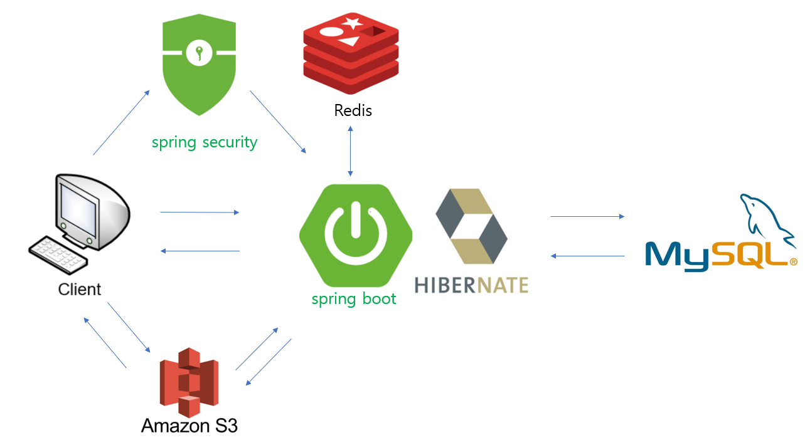
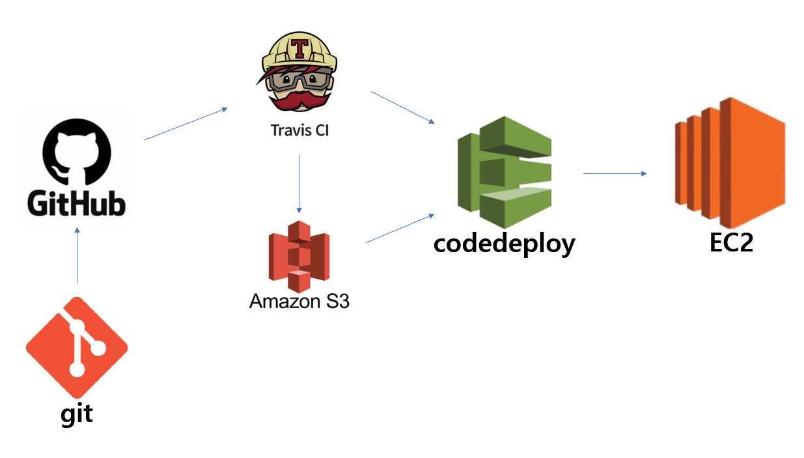
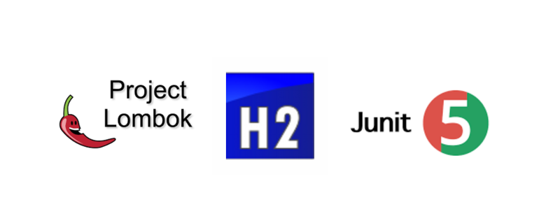
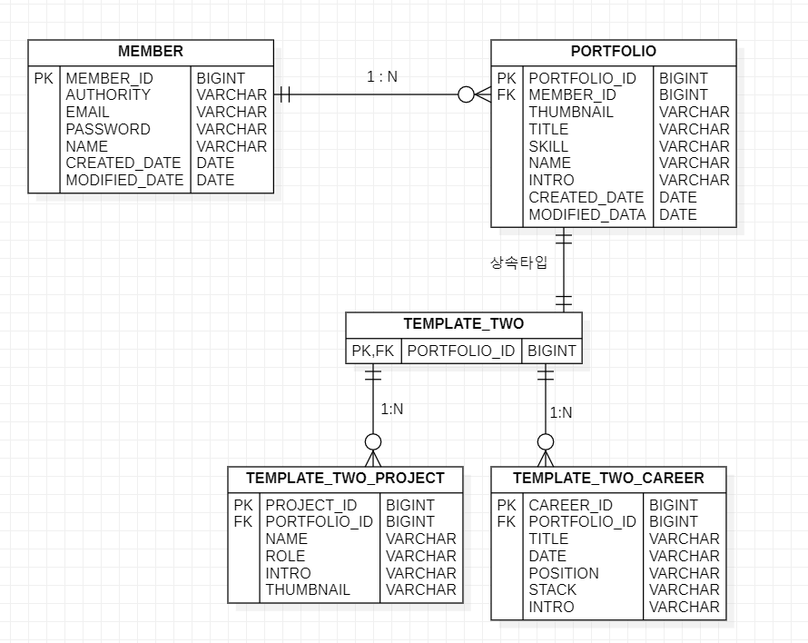

# APPEAL PROJECT BACKEND API

## 프로젝트 아키텍처

## 배포 방식

## 도움받은 기술

- spring web
- spring data-jpa
- spring mail
- spring validation
- p6spy(개발환경에서 쿼리와 파라미터 요청 콘솔로 확인)

## 테이블 설계

## 개발환경
- java 11
- spring boot 2.4.2

## 프로젝트 버전
1.0
- OCP를 지킨 PORTFOLIO 설계
- 회원 CRUD, application수준 세션 인증
- 다중 이미지 처리

1.1
- 인증 세션 HttpSession -> Redis로 변경

2.0(2021-02-23)
- 멀티모듈 프로젝트(단일 서버, 3개의 라이브러리 모듈)
- 메일인증을 위한 redis를 MailService에서 MemberService로 옮김

2.1(2021-02-24)
- 템플릿 이름 양식 변경(임의로 지정한 이름->TemplateTwo)
- TemplateTwo 동적으로 필드 추가 가능한 버전으로 변경

2.2(2021-02-25)
- MemberController ControllerAdvice연계 테스트 작성
- PortfolioDto 관련 생성 테스트 작성

## todo 리스트

- Portfolio 웹계층 테스트 마무리
- ID로 Portfolio 검색을 위해 JPA 복습하기
- DDD 관련 서적 읽고 도메인 별로 MSA구성하기

