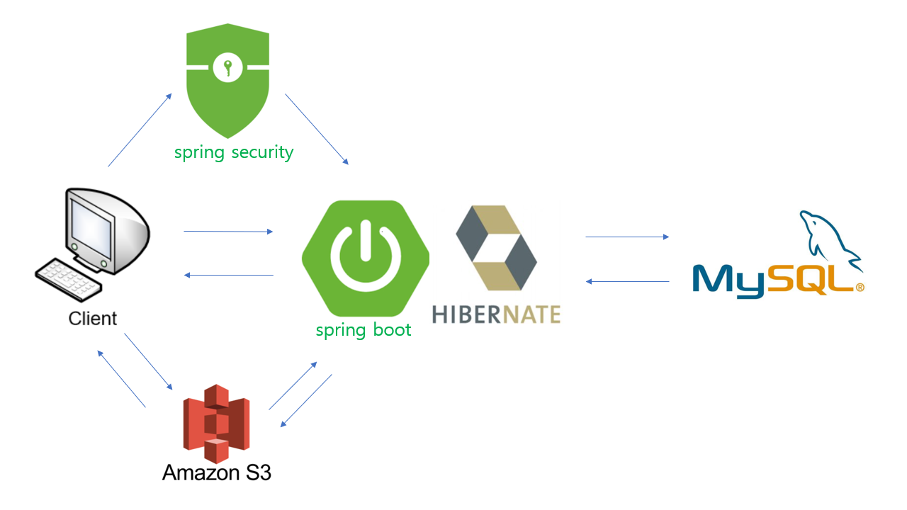
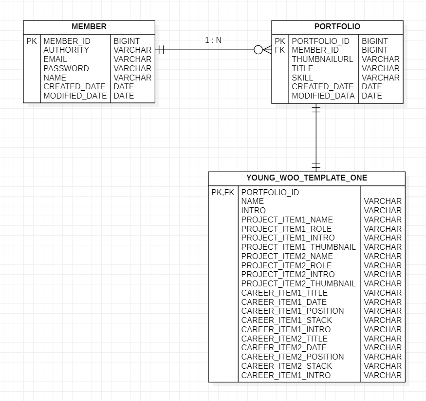

# APPEAL PROJECT BACKEND API

## 프로젝트 아키텍처

## 도움받은 기술

- spring web
- spring data-jpa
- spring mail
- spring validation
- p6spy(개발환경에서 쿼리와 파라미터 요청 콘솔로 확인)

## 테이블 설계

## 개발환경
- java 11
- spring boot 2.4.2
